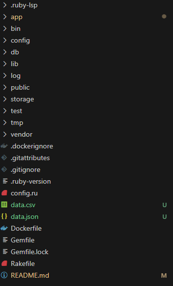

# How to start Part 1: Backend Task

##### Clone my repo
```
git clone https://github.com/p3rc1us/api_wrapper
```
##### Install gems
```
bundle install
```
##### Start 'em engines!
```
cd wrapper
```
```
bin/rails c
```
##### Initiate!
```
client = Restful::V1::Client.new
```
##### Run it, just replace `times` and `format` with how many times you want to run it and what format you wanted it.
```
client.objects(times, format)
```

##### Example Usage:
```
client.objects(3, :csv)
```
```
client.objects(3, :json)
```
```
client.objects(3, :console)
```

##### Reminder:
Look at the root folder for the `data.csv` and `data.json` files


# How to start Part 2: Frontend Task

##### With the same repository, we just need to transfer to another branch!(from main branch)
```
git checkout -b
